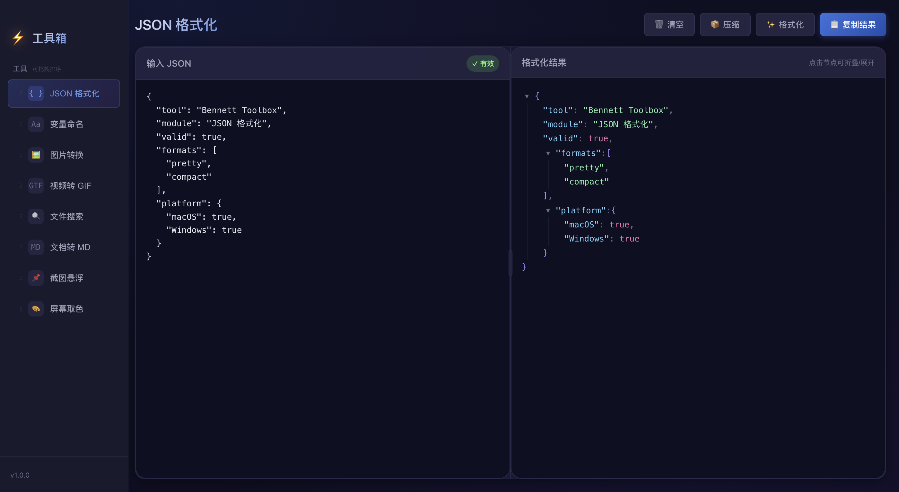
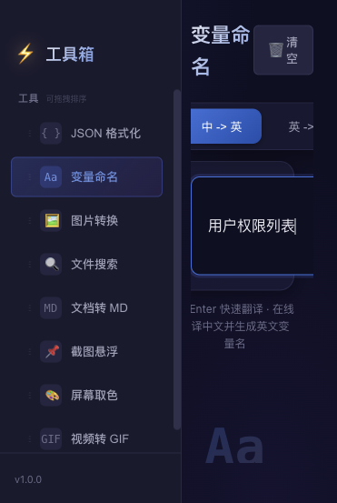
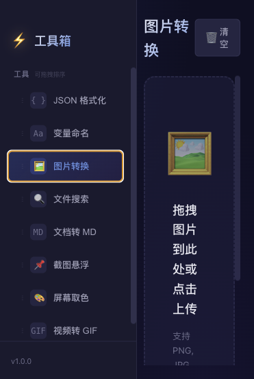
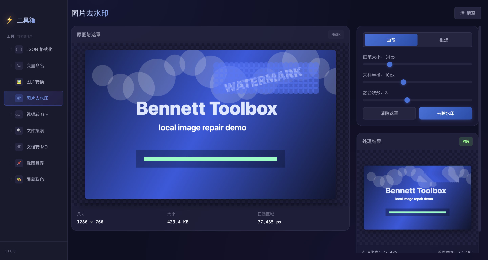
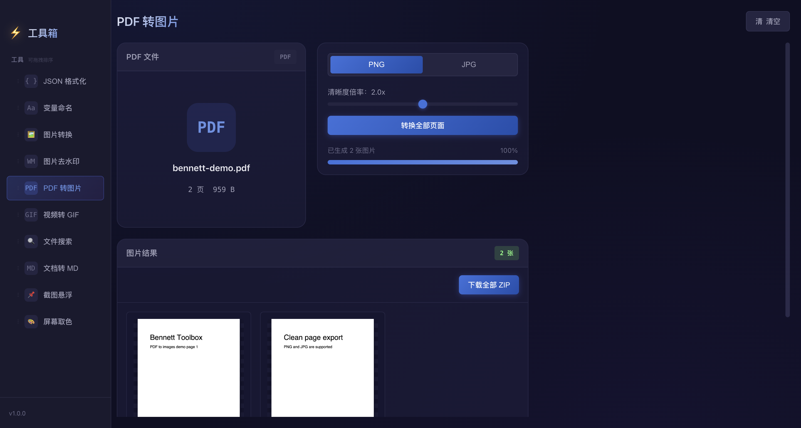
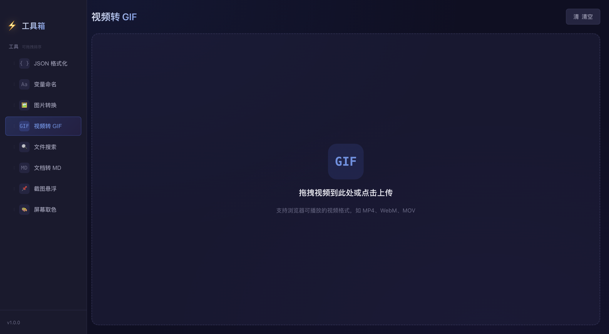
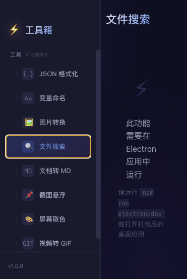
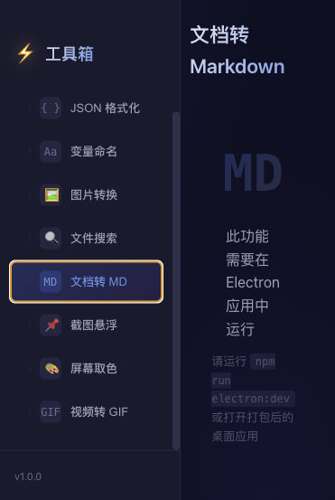
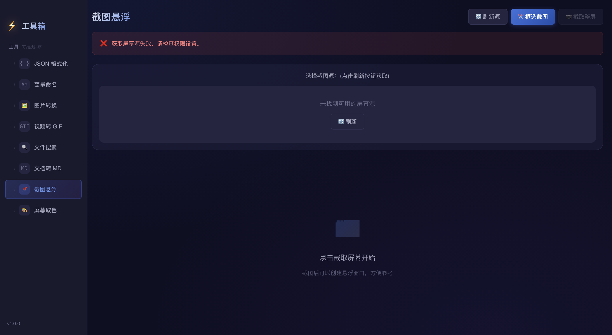
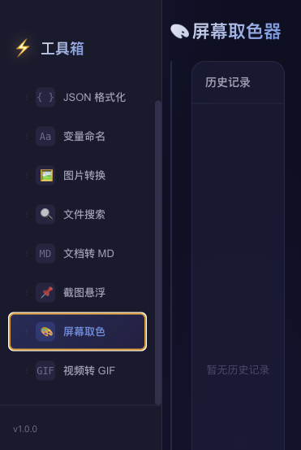

# Bennett Toolbox

[](https://github.com/bennett-lee/bennett-toolbox/actions/workflows/build-desktop-packages.yml)
[](https://github.com/bennett-lee/bennett-toolbox/releases/latest)
[](LICENSE)

Bennett Toolbox 是一个基于 Electron、React、Vite 和 TypeScript 的桌面工具箱。
它把常用的开发、文件、图片和截图工具放在一个本地应用里，适合日常快速处理
数据、命名、格式转换和屏幕辅助任务。

## 功能演示

下面是应用主要功能的宽屏界面演示。

### JSON 格式化



### 变量命名



### 图片转换



### 图片去水印



### PDF 转图片



### 视频转 GIF



### 文件搜索



### 文档转 Markdown



### 截图悬浮



### 屏幕取色



## 功能

当前应用包含以下工具：

- JSON 格式化：格式化、校验和查看 JSON 内容。
- 变量命名：把中文或自然语言描述转换为常见变量命名风格。
- 图片转换：支持 PNG、JPG、WebP、GIF、SVG、ICO，以及 HEIC/HEIF。
- 图片去水印：框选或涂抹图片中的水印区域，并在本地生成修复后的 PNG。
- PDF 转图片：把 PDF 每一页渲染为一张 PNG 或 JPG，并支持打包下载。
- 视频转 GIF：从视频中截取片段，设置帧率、宽度和颜色数并生成 GIF。
- 文件搜索：在本地目录中搜索文件。
- 文档转 MD：通过随包的 MarkItDown 转换器把常见文档转为 Markdown。
- 截图悬浮：截取屏幕区域并以悬浮窗口展示。
- 屏幕取色：读取屏幕颜色并复制色值。

## 环境要求

本地开发需要安装以下环境：

- Node.js 18 或更高版本。
- npm。
- macOS、Windows，或支持 Electron 的桌面系统。

文档转 Markdown 功能使用内置 MarkItDown 可执行文件，不依赖用户机器全局安装
`markitdown`。你需要在打包前运行构建脚本生成对应平台的随包转换器。

## 安装依赖

在项目根目录运行以下命令安装依赖：

```bash
npm install
```

## 本地开发

运行 Electron 开发环境：

```bash
npm run electron:dev
```

只运行 Vite 前端开发服务：

```bash
npm run dev
```

## 构建 MarkItDown 转换器

在打包前运行以下命令生成内置 MarkItDown 转换器：

```bash
npm run setup:markitdown
```

生成结果会放在 `vendor/markitdown/` 目录下。该目录只保留占位文件到 Git，
平台相关的二进制文件不会提交。

<!-- prettier-ignore -->
> [!IMPORTANT]
> MarkItDown 转换器需要按目标系统分别构建。macOS 生成的 `markitdown`
> 不能在 Windows 中运行；Windows 包需要准备 `markitdown.exe`。

## 打包应用

构建当前平台安装包：

```bash
npm run build
```

构建 Windows x64 安装包：

```bash
npm run build -- --win --x64
```

构建 macOS 安装包时，如果本机没有可用签名证书，可以使用无签名构建：

```bash
CSC_IDENTITY_AUTO_DISCOVERY=false npm run build
```

构建产物会输出到 `release/` 目录。该目录不会提交到 Git。

## 下载最新安装包

每次推送到 `master` 分支后，GitHub Actions 会自动构建 macOS 和 Windows
安装包，并更新 `latest` GitHub Release。

你可以在以下地址下载最新安装包：

```text
https://github.com/bennett-lee/bennett-toolbox/releases/latest
```

<!-- prettier-ignore -->
> [!IMPORTANT]
> 安装包文件超过 GitHub 普通仓库文件的 100 MB 限制，因此不会直接提交到
> Git。它们会作为 GitHub Release 资产发布，用户仍然可以从 GitHub 页面直接
> 下载。

## 项目规范

项目包含常见的 GitHub 协作和维护文件：

- [贡献指南](CONTRIBUTING.md)
- [更新日志](CHANGELOG.md)
- [安全策略](SECURITY.md)
- [行为准则](CODE_OF_CONDUCT.md)
- [支持说明](SUPPORT.md)
- [MIT 许可证](LICENSE)

Issue 模板、拉取请求模板、Dependabot 配置和自动打包工作流位于 `.github/`
目录。

## 测试

运行单元测试：

```bash
npm test
```

运行 TypeScript 类型检查：

```bash
npm exec tsc -- --noEmit
```

运行前端和 Electron 主进程构建检查：

```bash
npm exec vite -- build
```

## 平台说明

HEIC/HEIF 图片转换在 macOS 下优先使用系统自带的 `sips` 命令，在 Windows
和其他平台下使用随应用安装的 `heic-convert` 转换库。该功能不要求用户额外
安装 HEIC 扩展或命令行工具。

## Git 提交约定

项目会忽略以下内容：

- `node_modules/`
- `dist/`
- `dist-electron/`
- `release/`
- `build_tools/`
- `vendor/markitdown/markitdown`
- `vendor/markitdown/markitdown.exe`

这样可以保持仓库只包含源码、配置、脚本和文档。
